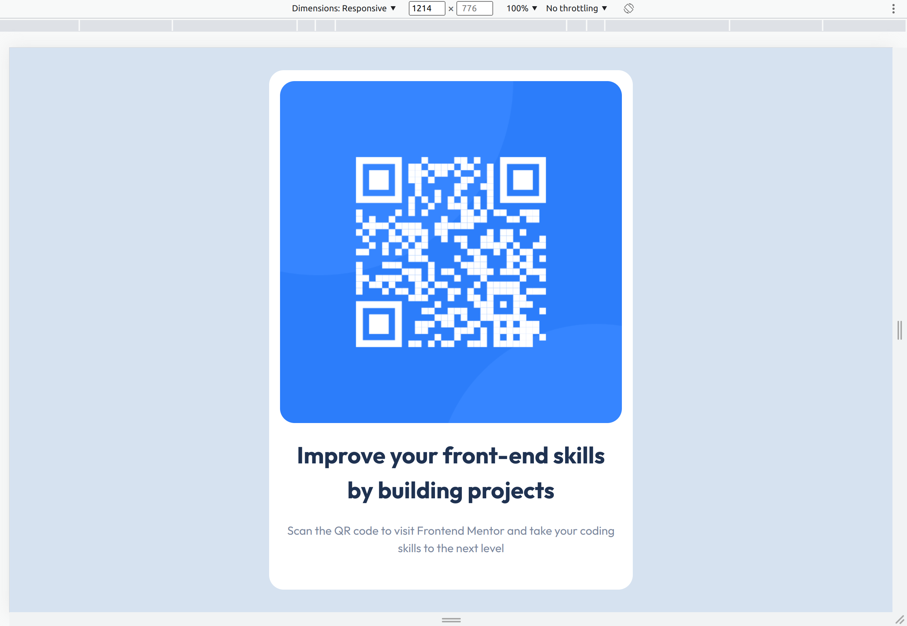

# Frontend Mentor - QR code component solution

This is a solution to the [QR code component challenge on Frontend Mentor](https://www.frontendmentor.io/challenges/qr-code-component-iux_sIO_H). Frontend Mentor challenges help you improve your coding skills by building realistic projects.

## Overview

This is a static web page of qr-code component.

### Screenshot

### Links

-   Solution URL: [Add solution URL here](https://www.frontendmentor.io/solutions/qr-code-component-yvpswrahl6)
-   Live Site URL: [Add live site URL here](https://yashk71097.github.io/frontend-mentor/)

### Built with

-   Semantic HTML5 markup
-   CSS custom properties
-   CSS Utility Classes
-   Flexbox
-   Clamp Function
-   Mobile-first workflow
    For styles

## Author

-   Website - [Yash Pathik](https://www.your-site.com)
-   Frontend Mentor - [@yashk71097](https://www.frontendmentor.io/profile/yashk71097)
